# Active Directory Home Lab – Windows Server 2022

## Overview

This project demonstrates the setup and configuration of an Active Directory environment using Windows Server 2022 and a Windows 10 client machine in a virtual lab.

The lab simulates a real-world enterprise network by implementing domain services, user and group management, access control, and domain authentication.

---

## Lab Environment

* **Domain Controller:** RTS-DC1
* **Domain Name:** rtsnetworking.local
* **Client Machine:** CLIENT1
* **Virtualization:** VirtualBox
* **Network Type:** Internal Network (ADLab)

---

## Objectives

* Install and configure Active Directory Domain Services (AD DS)
* Create and manage domain users and groups
* Configure internal network communication between VMs
* Implement group-based access control
* Join a Windows client machine to the domain
* Authenticate users through Active Directory

---

## Network Configuration

Both virtual machines were configured on an isolated internal network to simulate a controlled enterprise environment.

### Server Internal Network Configuration

📁 screenshots/server-internal-network-adlab.png
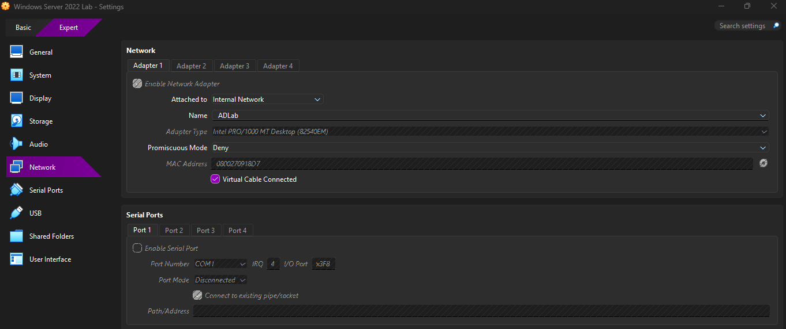

---

### Client Internal Network Configuration

📁 screenshots/client-internal-network-adlab.png
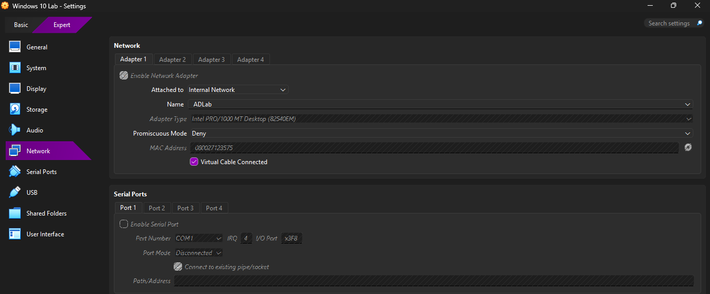

---

### Static IP Configuration (Server)

📁 screenshots/server-ip-config.png
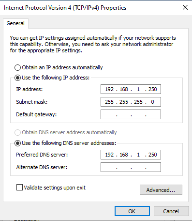

---

## Active Directory Installation

### AD Role Selection

📁 screenshots/server-ad-role-selection.png
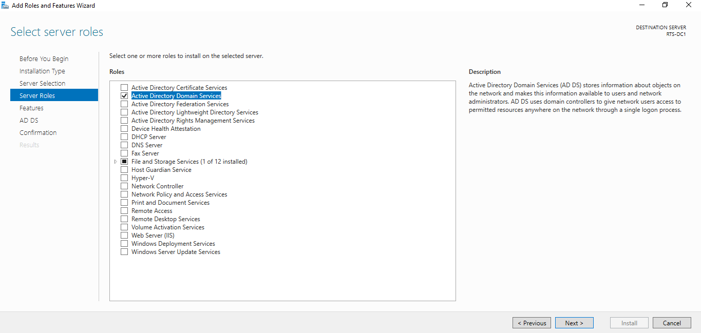

---

### Installation Confirmation

📁 screenshots/server-ad-install-confirm.png
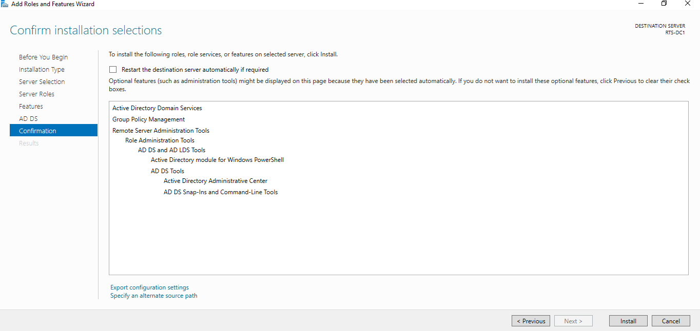

---

### Installation Complete

📁 screenshots/server-ad-install-complete.png
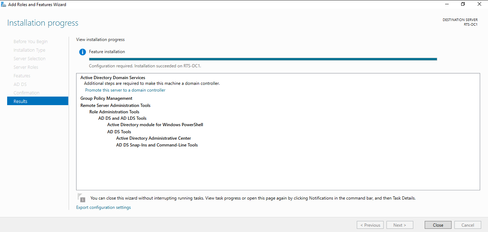

---

### Domain Setup (New Forest)

📁 screenshots/server-domain-setup.png
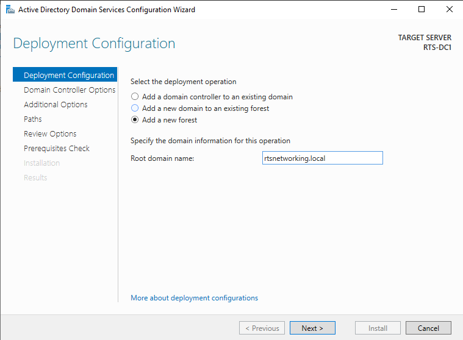

---

### Domain Controller Options

📁 screenshots/server-dc-options.png
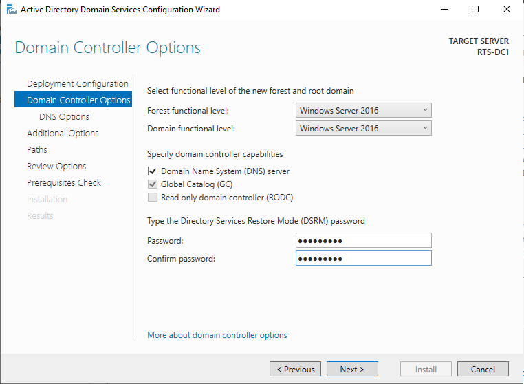

---

### Prerequisites Check

📁 screenshots/server-prereq-check.png
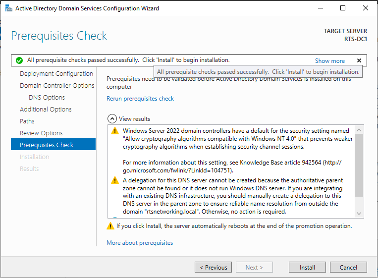

---

## User and Group Management

Multiple users were created to simulate a real-world environment.

### User Creation

📁 screenshots/server-user-creation.png
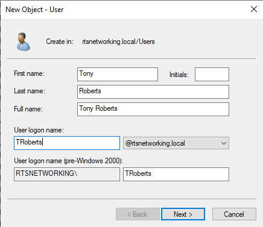

---

### Active Directory Users List

📁 screenshots/server-ad-users-list.png

---

### Security Group Creation

📁 screenshots/server-security-group-sales.png
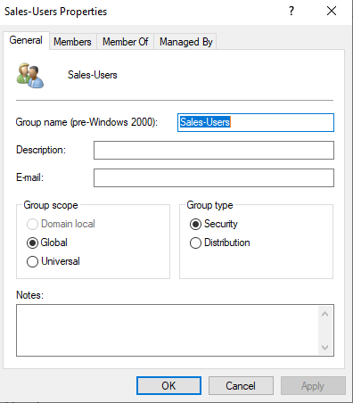

---

### Group Members

📁 screenshots/server-group-members.png
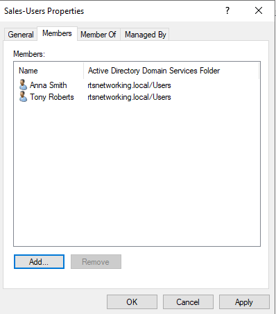

---

## Group-Based Access Control

A shared folder was created and permissions were assigned to the **Sales-Users** group.

### Folder Permissions

📁 screenshots/server-group-permissions.png
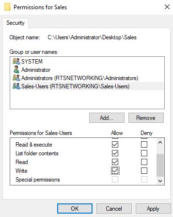

---

## Domain Join and Authentication

The Windows 10 client machine was successfully joined to the domain.

### Domain Join Success

📁 screenshots/client-domain-join-success.png
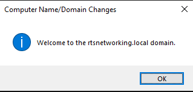

---

### Domain User Login

📁 screenshots/client-domain-login.png
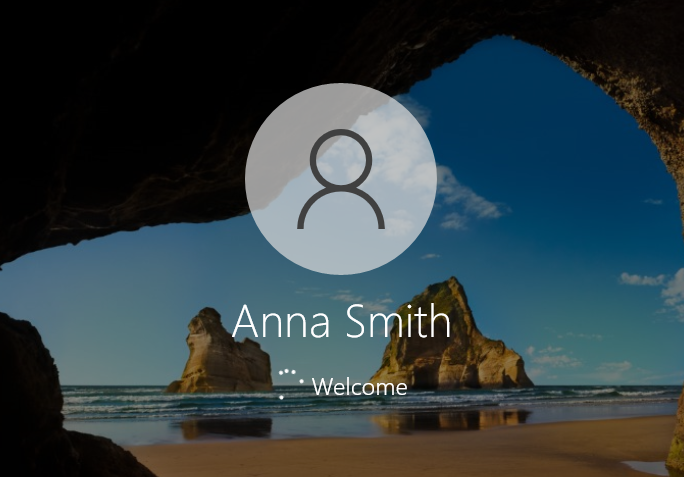

---

### Authentication Verification (whoami)

📁 screenshots/client-domain-login-verify.png
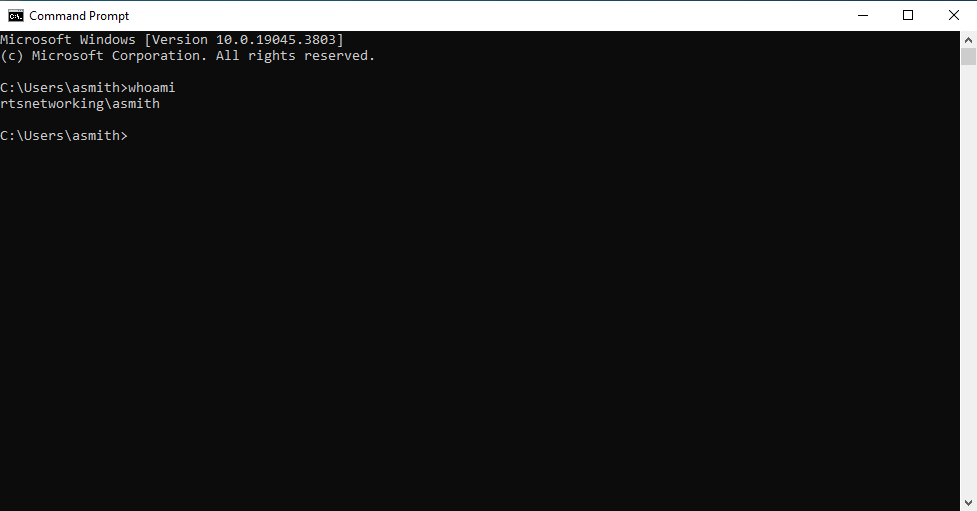

---

## Challenges

* Encountered network connectivity issues (General failure on ping) due to incorrect network configuration
* Resolved by ensuring both VMs were on the same internal network and adjusting firewall settings
* Initially used incorrect user credentials when joining the domain, highlighting the importance of administrative permissions

---

## Lessons Learned

* Importance of proper network configuration in virtual environments
* Understanding of Active Directory structure and authentication
* Value of group-based access control in enterprise environments
* Troubleshooting common domain join and connectivity issues

---

## Conclusion

This lab demonstrates the foundational skills required to manage an Active Directory environment, including domain setup, user and group management, and client authentication.

These skills are essential for IT support, system administration, and cybersecurity roles.
