# Active Directory Home Lab – Windows Server 2022

## Overview

This project demonstrates the setup and configuration of an Active Directory environment using Windows Server 2022 and a Windows 10 client machine in a virtual lab.

The lab simulates a real-world enterprise network by implementing domain services, user and group management, access control, and domain authentication.

---

## Lab Environment

* **Domain Controller:** RTS-DC1
* **Domain Name:** rtsnetworking.local
* **Client Machine:** CLIENT1
* **Virtualization:** VirtualBox
* **Network Type:** Internal Network (ADLab)

---

## Objectives

* Install and configure Active Directory Domain Services (AD DS)
* Create and manage domain users and groups
* Configure internal network communication between VMs
* Implement group-based access control
* Join a Windows client machine to the domain
* Authenticate users through Active Directory

---

## Network Configuration

Both virtual machines were configured on an isolated internal network to simulate a controlled enterprise environment.

### Server Internal Network Configuration

📁 screenshots/server-internal-network-adlab.png
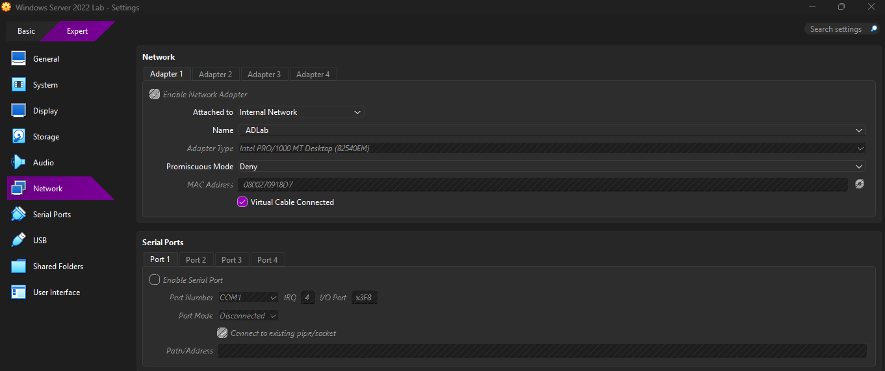

---

### Client Internal Network Configuration

📁 screenshots/client-internal-network-adlab.png
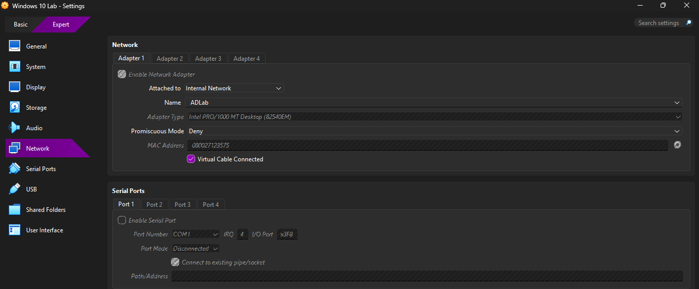

---

### Static IP Configuration (Server)

📁 screenshots/server-ip-config.png
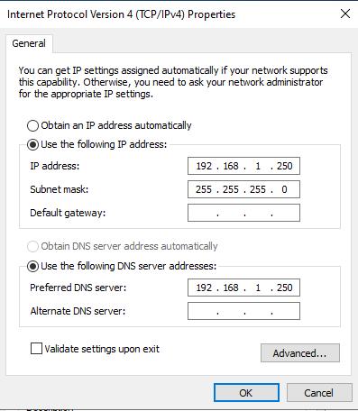

---

## Active Directory Installation

### AD Role Selection

📁 screenshots/server-ad-role-selection.png
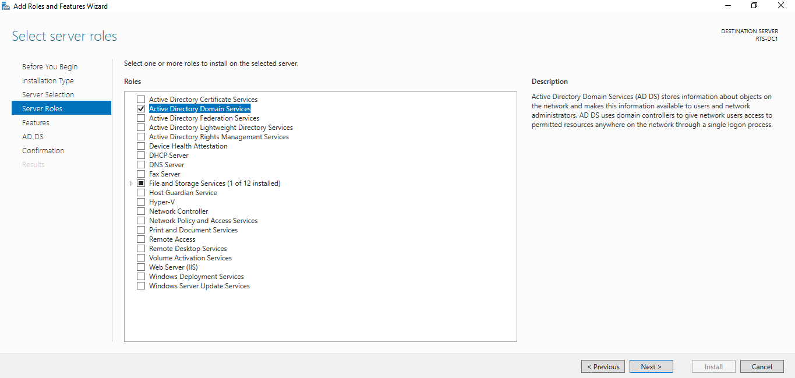

---

### Installation Confirmation

📁 screenshots/server-ad-install-confirm.png
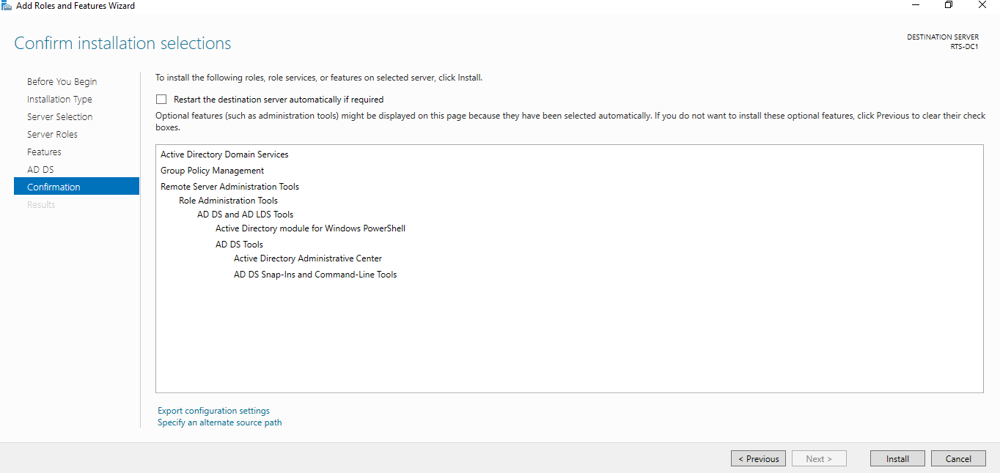

---

### Installation Complete

📁 screenshots/server-ad-install-complete.png
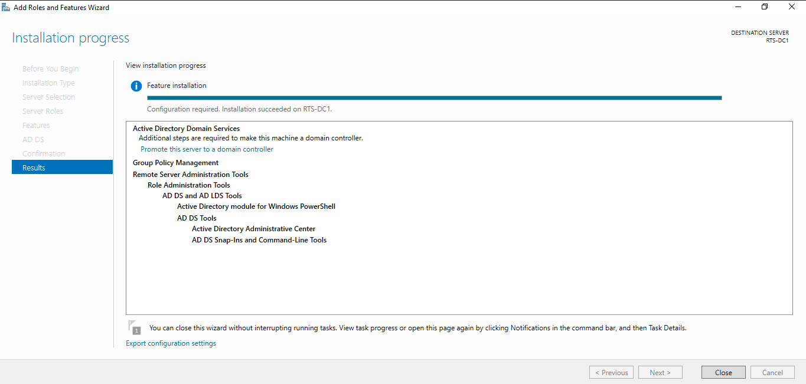

---

### Domain Setup (New Forest)

📁 screenshots/server-domain-setup.png
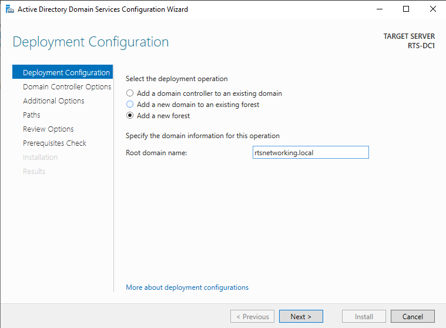

---

### Domain Controller Options

📁 screenshots/server-dc-options.png
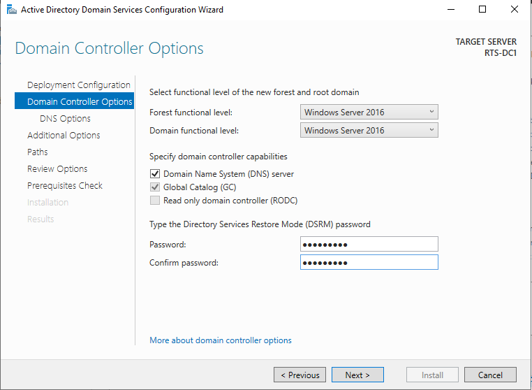

---

### Prerequisites Check

📁 screenshots/server-prereq-check.png
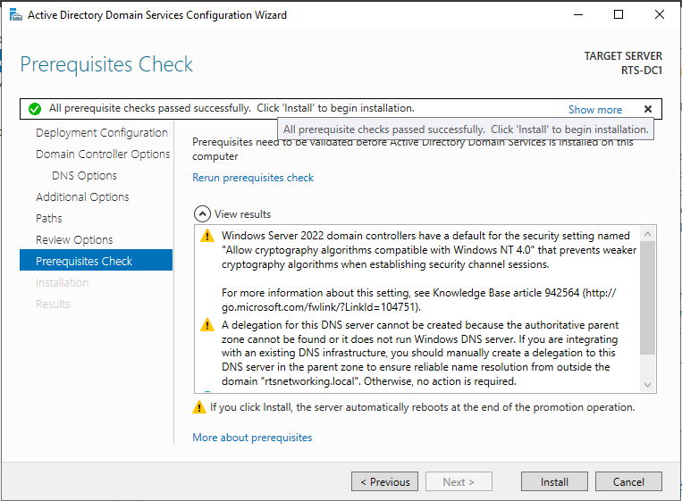

---

## User and Group Management

Multiple users were created to simulate a real-world environment.

### User Creation

📁 screenshots/server-user-creation.png
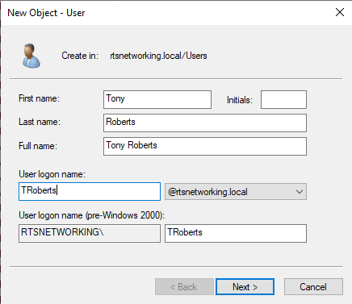

---

### Active Directory Users List

📁 screenshots/server-ad-users-list.png


---

### Security Group Creation

📁 screenshots/server-security-group-sales.png
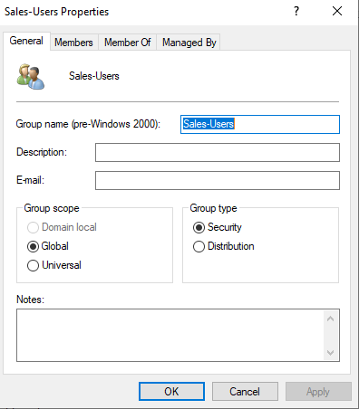

---

### Group Members

📁 screenshots/server-group-members.png
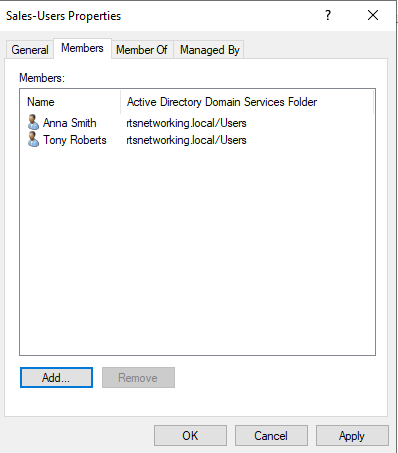

---

## Group-Based Access Control

A shared folder was created and permissions were assigned to the **Sales-Users** group.

### Folder Permissions

📁 screenshots/server-group-permissions.png
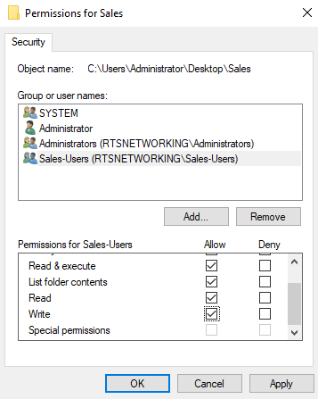

---

## Domain Join and Authentication

The Windows 10 client machine was successfully joined to the domain.

### Domain Join Success

📁 screenshots/client-domain-join-success.png
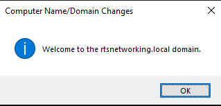

---

### Domain User Login

📁 screenshots/client-domain-login.png
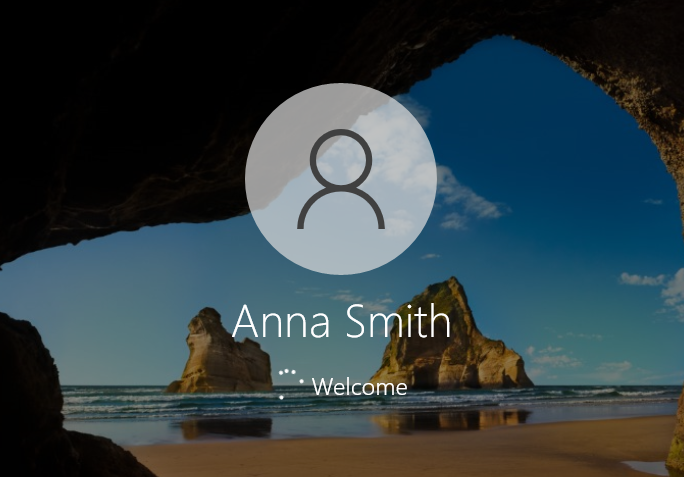

---

### Authentication Verification (whoami)

📁 screenshots/client-domain-login-verify.png
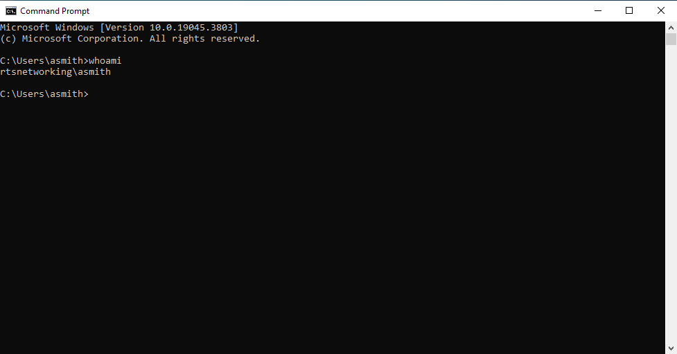

---

## Organizational Unit (OU) Design and Structure

After establishing domain connectivity and user authentication, the environment was restructured to reflect a more realistic enterprise Active Directory design using Organizational Units (OUs).

The purpose of implementing OUs is to logically separate users and systems based on function, enabling more efficient administration and targeted Group Policy application.

This structure supports security principles such as least privilege and controlled access by enabling policies to be applied based on role and system type.

---

### Initial Active Directory Structure

Before implementing OUs, all users and computers were located in default containers such as **Users** and **Computers**.

📁 screenshots/ad-default-structure.png

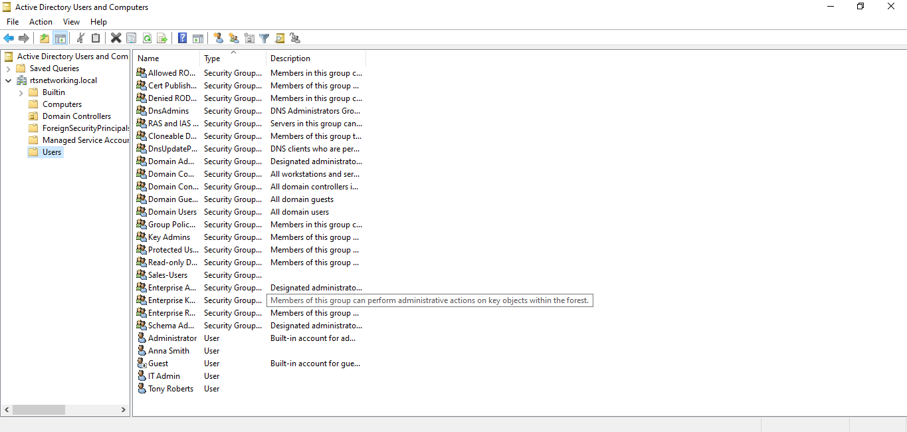


---

### Top-Level OU Creation

Top-level Organizational Units were created to separate major components of the environment:

* Departments
* Workstations
* Servers

📁 screenshots/ad-top-level-ous-created.png

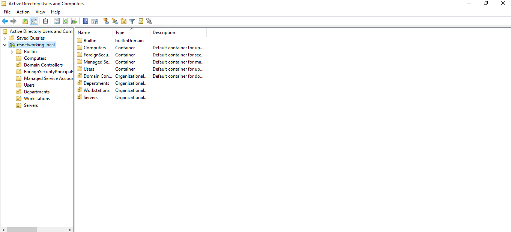

---

### Departmental OU Structure

Within the **Departments OU**, sub-OUs were created to represent business functions:

* IT
* Sales
* HR

This structure enables role-based organization and prepares the environment for department-specific policies.

📁 screenshots/ad-department-ous-created.png

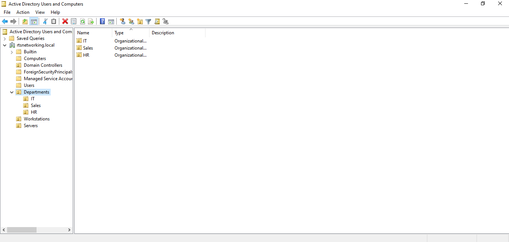

---

### User Organization by Department

User accounts were moved from the default Users container into their respective departmental OUs:

* **Sales OU:** Anna Smith, Tony Roberts
* **IT OU:** IT Admin

This demonstrates role-based organization and supports future policy enforcement.

📁 screenshots/ad-users-sales-ou.png

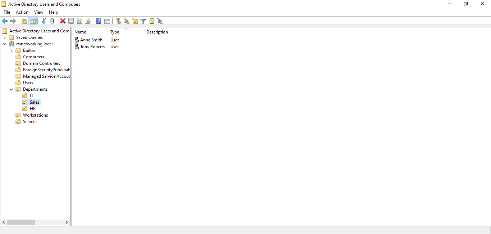

📁 screenshots/ad-users-it-ou.png

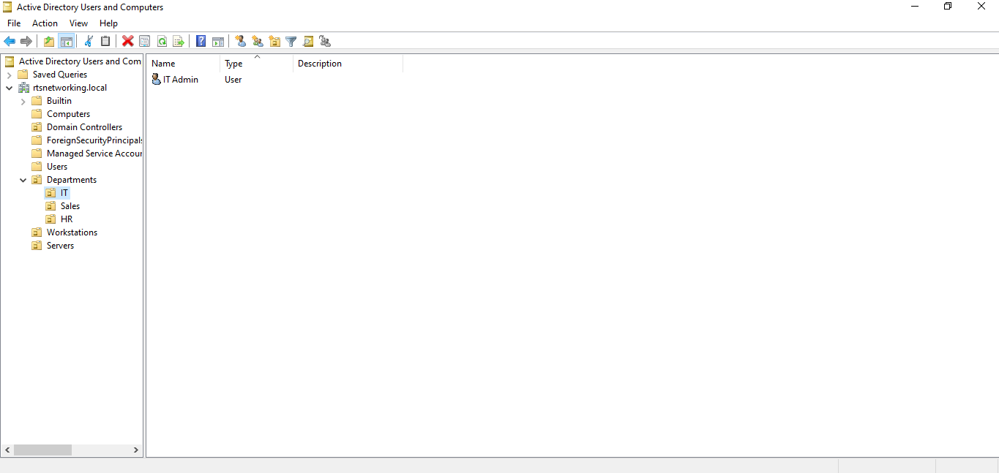

---

### Workstation Organization

The client machine (CLIENT1) was moved from the default **Computers** container into the **Workstations OU**.

This separation allows administrators to apply policies specifically to endpoint devices.

📁 screenshots/ad-client-moved-to-workstations.png

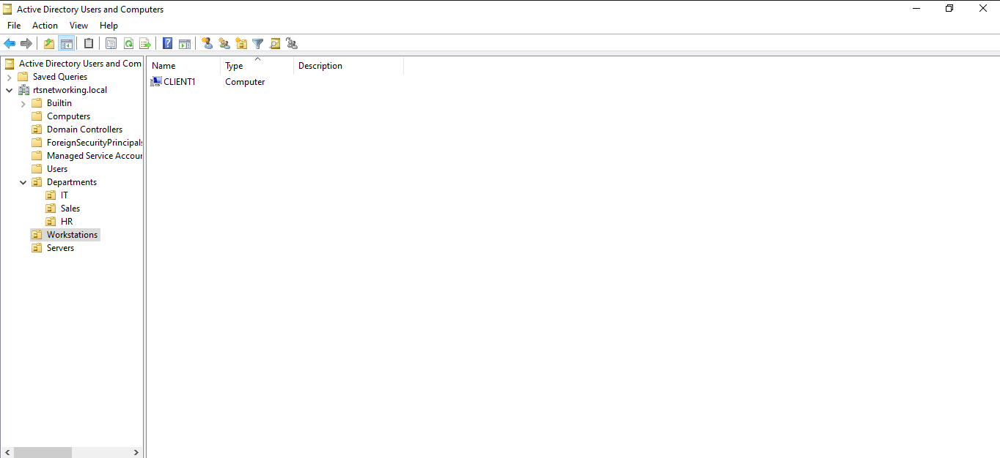

---

### Final OU Structure

Due to display limitations, the full OU structure is represented across multiple screenshots.

The completed Organizational Unit structure reflects a simplified enterprise environment:

```text
rtsnetworking.local
│
├── Departments
│   ├── IT
│   ├── Sales
│   └── HR
│
├── Workstations
│   └── CLIENT1
│
└── Servers

---
```
### Key Takeaways

* Organizational Units provide logical structure for Active Directory environments
* Separating users and systems enables targeted administrative control
* OU design is essential for effective Group Policy deployment
* Default containers (Users, Computers) are not suitable for scalable environments
* Proper organization improves security, manageability, and clarity

## Challenges

### Network Connectivity Issue

During initial setup, the client machine was unable to communicate with the domain controller, resulting in a “General failure” when attempting to ping the server.

**Diagnosis:**

* Verified IP configuration on both machines
* Confirmed both virtual machines were assigned to the same VirtualBox internal network
* Identified that communication was blocked despite correct addressing

**Resolution:**

* Adjusted Windows Firewall settings on the client machine
* Ensured both systems were on the same subnet and configured with the domain controller as the DNS server

**Result:**

* Successful communication between server and client
* Enabled domain join and further Active Directory configuration

---

### Domain Join Authentication Issue

While joining the client machine to the domain, incorrect credentials were initially used, resulting in authentication failure.

**Diagnosis:**

* Attempted to join the domain using standard user credentials instead of domain administrator credentials

**Resolution:**

* Used domain administrator credentials created during Active Directory setup

**Result:**

* Successful domain join and authentication of client machine

---

### Server Manager Visibility Issue

After domain join, the client system initially appeared as inaccessible within Server Manager.

**Diagnosis:**

* Verified network connectivity using ping
* Identified that remote management services were not fully enabled
* Observed system message: “Cannot manage a client-based operating system”

**Resolution:**

* Enabled Windows Remote Management (WinRM) on the client machine
* Verified firewall settings and network profile configuration

**Result:**

* Client system displayed as “Online”
* Learned that Windows 10 systems are not fully manageable through Server Manager by design

---

### Organizational Unit Implementation

After initial setup, users and computers were located in default Active Directory containers, which are not suitable for scalable or secure enterprise environments.

**Diagnosis:**

* Default containers (Users, Computers) do not support granular Group Policy application
* Lack of separation between departments and systems limits administrative control

**Resolution:**

* Created Organizational Units (Departments, Workstations, Servers)
* Implemented sub-OUs for IT, Sales, and HR
* Moved users and client machine into appropriate OUs

**Result:**

* Environment now supports role-based organization and targeted policy application
* Improved administrative structure, scalability, and alignment with enterprise practices

---

## Lessons Learned

* Importance of proper network configuration in virtual environments
* Understanding of Active Directory structure and authentication
* Value of group-based access control in enterprise environments
* Troubleshooting common domain join and connectivity issues

---

## Conclusion

This lab demonstrates the foundational skills required to manage an Active Directory environment, including domain setup, user and group management, and client authentication.

These skills are essential for IT support, system administration, and cybersecurity roles.

---
